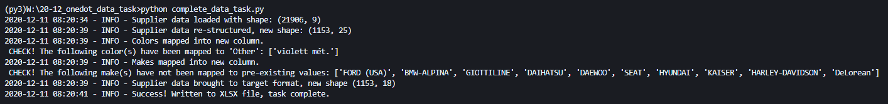

# ONEDOT DATA TASK

Dec 2020

## Task Description

Transform supplier data in a way that permits to load it into the given target dataset without any other changes. The
processing has to be documented in three distinct steps:

1) Pre-processing: to achieve the same granularity as the target data (in this case: bring into a tidy format)
2) Normalization: to map similar attributes with different spellings / formats (exemplary, for the 2 attributes `color` and `make`)
3) Integration: to apply the data schema of the target data to the supplier data

The process is resulting in an Excel spreadsheet with 3 tabs showing the results of each step described above.

## Run The Script

Run the process and generate a new Excel from the main folder (containing this README file) with the following command:

```python
python execute_data_task.py
```

## Output

### Excel File

Each time when running the script, a new, timestamped XLSX-file is created in the main folder (the one containing this README file).

_NOTE: The mapped attributes in step 2 are appended as new columns to the data output from step 1 (they are highlighted yellow, but you'll probably have to scroll to see them). The original attributes are not changed yet, they will be removed only in step 3._

### Log Messages

As a little extra, simple logging is provided. It's main purpose is to notify the user when certain values in the supplier data could not be mapped to pre-existing values in the target data. This may  indicate that additional steps have to be taken.

For example:



## Build

The script runs on Python >= 3.6 and requires the following third-party libraries:

- `numpy`
- `pandas`
- `xlsxwriter`
- `pyarrow` (for reading of the target data only, could be replaced with `xlread` or similar)
